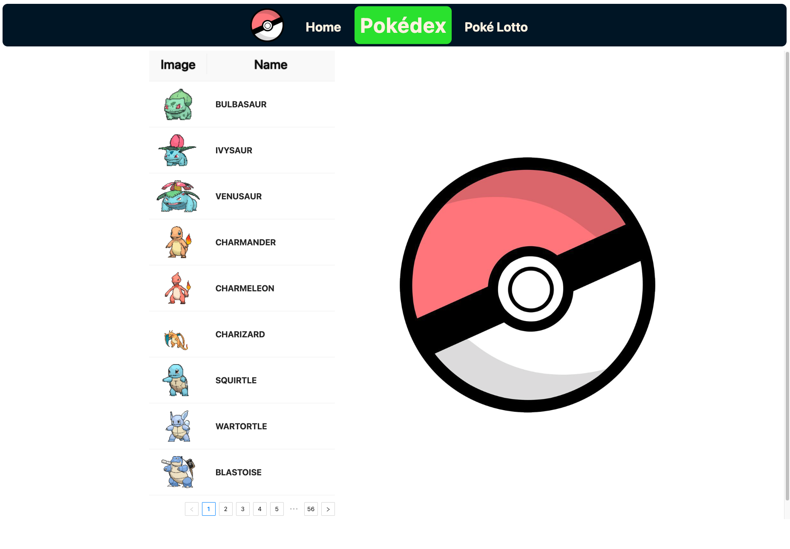

# AngularFirst

##### almost done

1. Display of Pokémon encyclopedia, the number to be displayed can be defined in `POKEMON_AMOUNT` in the `/src/app/core/constants/Pokomon.api.ts`

2. Pokémon can be captured randomly, which requires a pokemon coin

3. Pokemon coin recharge is realized and recharge history can be found by button recharge history in Poke Lotto.

### UI

#### Pokédex



You can check all Pokémon Pokédex here

#### Pokémon lotto


1. Here you can randomly get a Pokémon, including legendary ones.
2. Each time you spend one gold coin, if you don't have gold coins, you can recharge and check the recharge history.
3. All the Pokémon you have drawn will be displayed on the right

## Development server

To start a local development server, run:

```bash
ng serve
```

Once the server is running, open your browser and navigate to `http://localhost:4200/`. The application will automatically reload whenever you modify any of the source files.

## Building

To build the project run:

```bash
ng build
```

## Running unit tests

To execute unit tests with the [Karma](https://karma-runner.github.io) test runner, use the following command:

```bash
ng test
```

### PS: Database use json-server

```
npx json-server db/db.json
```

or

```
npm run db
```

Runs the test-server.
Open http://localhost:9009/users to view data in Browser.

To install test-server, run: `npm install -g json-server`
