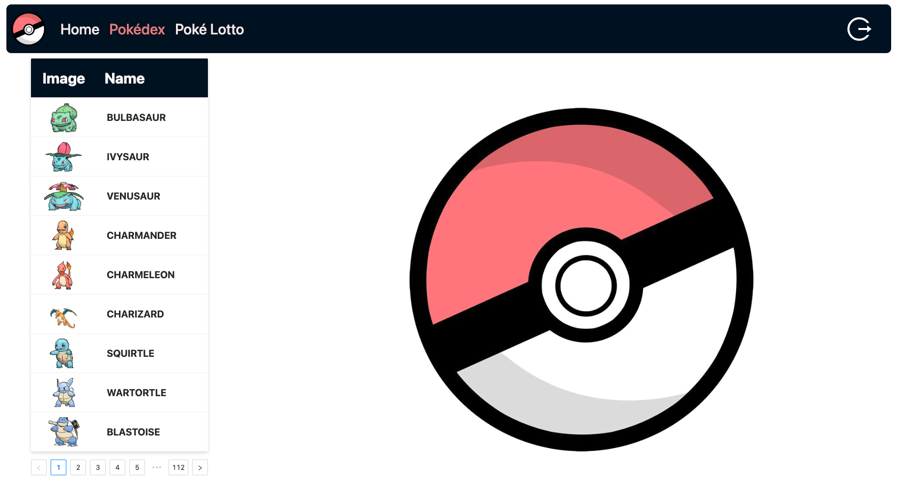

# Angular pokemon

## Quickly start

The project can currently use docker to set up the backend. You only need to enter the `npm run setup_backend` command in the console to complete the backend deployment.

If the deployment is complete, after stopping the container, you can start the container by running the `npm run sb_server` command.

Prerequisite: Make sure you have installed docker

##### almost done

1. Display of Pokémon encyclopedia, the number to be displayed can be defined in `POKEMON_AMOUNT` in the `/src/app/core/constants/API-Setting.ts`

2. Pokémon can be captured randomly, which requires a pokemon coin

3. Pokemon coin recharge is realized and recharge history can be found by button recharge history in Poke Lotto.

### UI

#### Login and Logout


#### Pokédex


<!-- ![Pokédex] (public/pokedex.png) -->

You can check all Pokémon Pokédex here

#### Pokémon lotto


1. Here you can randomly get a Pokémon, including legendary ones.
2. Each time you spend one gold coin, if you don't have gold coins, you can recharge and check the recharge history.
3. All the Pokémon you have drawn will be displayed on the right

## Development server

To start a local development server, run:

```bash
ng serve
```

Once the server is running, open your browser and navigate to `http://localhost:4200/`. The application will automatically reload whenever you modify any of the source files.

## Building

To build the project run:

```bash
ng build
```

<!-- ## Running unit tests

To execute unit tests with the [Karma](https://karma-runner.github.io) test runner, use the following command:

```bash
ng test
``` -->

## The database using json-server is now invalid because it cannot support the login feature.

~~PS: Database use json-server~~ json server was removed on 05.18.2025

## Now please use my backend server with springboot

```
sb_backend 👉 git@github.com:lzruiv4/sb_backend.git
```
