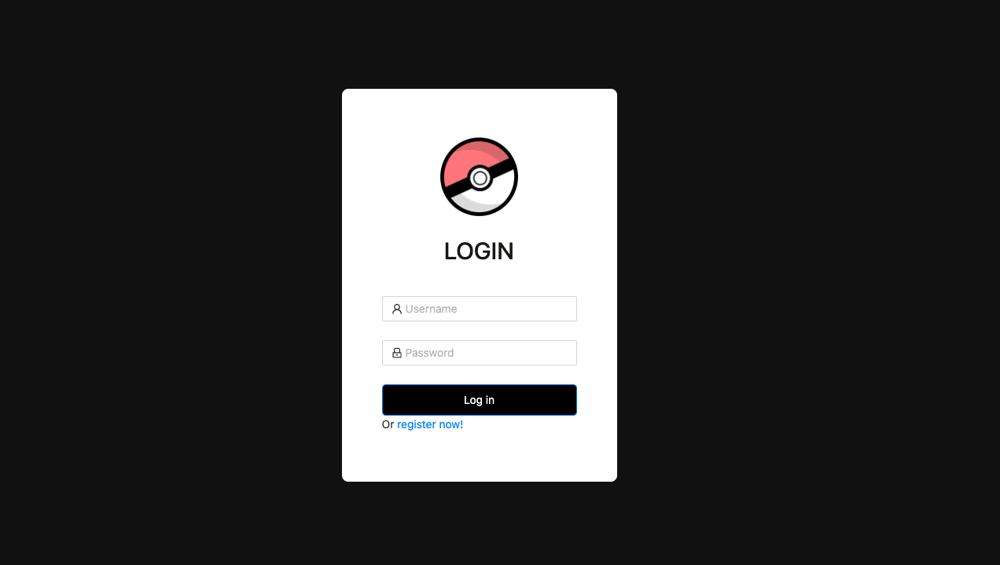
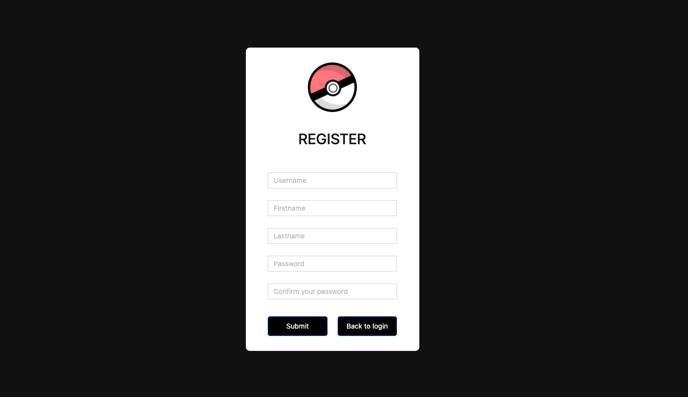

# Angular pokemon

## Quickly start

#### Backend with springboot

The project can currently use docker to set up the backend.
You only need to give the following command in the terminal to deploy the backend with springboot.

```bash
npm run setup-backend
```

#### New Start the backend

After the initial deployment, you can simply enter the following command in the terminal to quickly start the container next time.

```bash
npm run backend
```

Prerequisite: Make sure you have installed docker

#### Start the frontend

To start the frontend UI, run:

```bash
ng serve
```

#### Start with docker

PS: Make sure the backend is running. And set the port to 4200

```bash
# build image
docker build -t my-angular-app .
# run the container
docker run -d -p 4200:80 my-angular-app
```

## Almost done

1. Display of Pokémon encyclopedia, the number to be displayed can be defined in `POKEMON_AMOUNT` in the `/src/app/core/constants/API-Setting.ts`

2. Pokémon can be captured randomly, which requires a pokemon coin

3. Pokemon coin recharge is realized and recharge history can be found by button recharge history in Poke Lotto.

## UI

#### Login and Logout





#### Pokédex


<!-- ![Pokédex] (public/pokedex.png) -->

You can check all Pokémon Pokédex here

#### Pokémon lotto


1. Here you can randomly get a Pokémon, including legendary.
2. Each time you spend one gold coin, if you don't have gold coins, you can recharge and check the recharge history.
3. All the Pokémon you have drawn will be displayed on the right

## Running unit tests

To execute unit tests with the [Karma](https://karma-runner.github.io) test runner, use the following command:

```bash
ng test
```

## Update timelines

#### 2025.05.18 -> The database using json-server is now invalid because it cannot support the login feature.

~~PS: Database use json-server~~ json server was removed on 05.18.2025

#### 2025.05.01 -> Now please use my backend server with springboot

sb_backend 👇

```
https://github.com/lzruiv4/sb-backend
```
